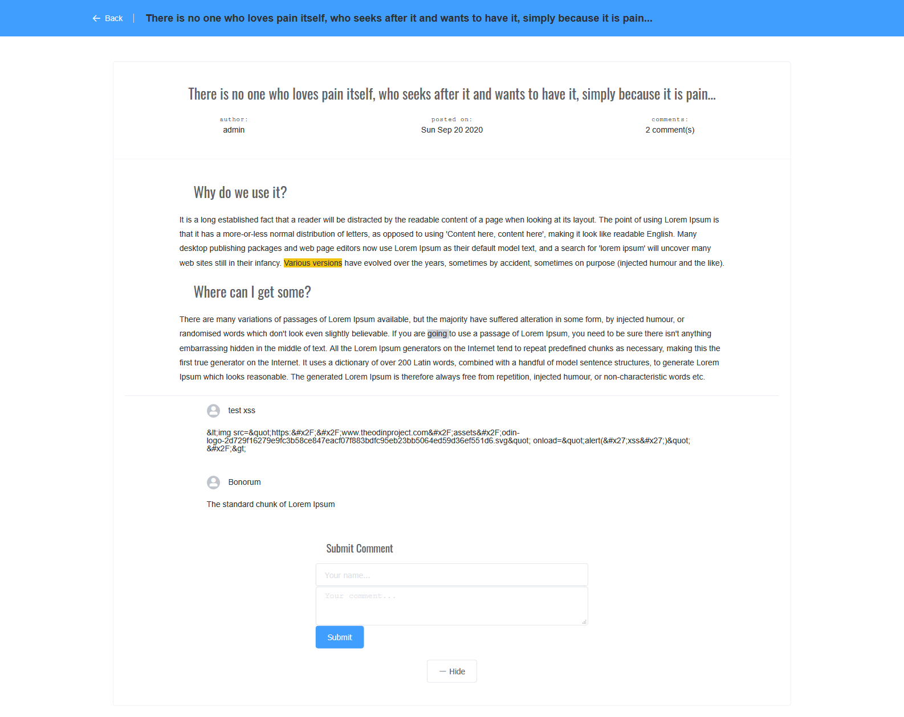

# blogcms-client

Cms-client is a app built with Vue which renders the content stored in blogcms-api server. Users can view blog posts and leave comments. The client communicates with the server via REST API and JSON responses. Comments posted are sanitized to prevent XSS attacks.

It is part of the system that makes up headless cms system.

-View **CMS-admin** [here](https://github.com/leoltl/blogcms-admin)
-View **CMS-api** [here](https://github.com/leoltl/blogcms-api)

## The stack
- **Client side**: Vue.js (Vue 3 syntax)
- **UI library**: Element UI

## Live App
**View it on [here](https://leoltl-blogcms-client.herokuapp.com/)**

## Features
**As an unauthenticated user**:
- I can see a list of all blog posts.
- I can see an individual blog post.
- I can post a comment replying to a post.

#### TODO
- support posting of images in comments
- add analytics calls to record post views
